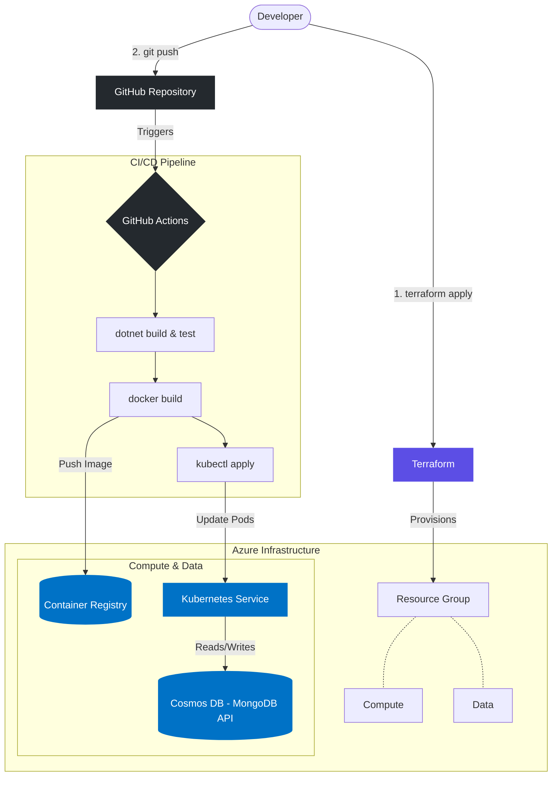

# Renting Microservice

A vehicle fleet management microservice built with **.NET 9** and **MongoDB**, following **Hexagonal Architecture** (Ports & Adapters) and **Domain-Driven Design** principles.

## Tech Stack

- **.NET 9** (ASP.NET Core Web API)
- **MongoDB** (NoSQL persistence)
- **MediatR** (CQRS — Command/Query separation via Mediator pattern)
- **xUnit** + **Moq** (Unit, Infrastructure & Functional tests)
- **Docker Compose** (Local MongoDB)
- **Swagger / OpenAPI** (API documentation)

## Architecture

This project implements a clean **Hexagonal Architecture** where the domain layer has zero dependencies on infrastructure or frameworks:

```
src/
├── Renting.Microservice.Domain/            # Entities, Value Objects, Ports, Exceptions
├── Renting.Microservice.ApplicationCore/   # Use Cases (Input/Output ports)
├── Renting.Microservice.Api/              # Controllers, MediatR Handlers, Presenters
├── Renting.Microservice.Infrastructure/   # MongoDB Repositories, Logging Adapters
├── Renting.Microservice.Host/            # Composition Root (DI, Program.cs)
└── microservice.sln

test/
├── unit/           # 13 unit tests (domain logic + use cases with Moq)
├── functional/     # 1 functional test (full MediatR pipeline + real MongoDB)
├── infrastructure/ # 1 infrastructure test (HTTP pipeline via TestServer)
└── load/           # JMeter (placeholder)
```

### Key Design Decisions

- **Ports & Adapters**: Domain defines interfaces (`IVehicleRepository`, `IRentalRepository`). Infrastructure implements them with MongoDB.
- **CQRS with MediatR**: Each use case is a dedicated `IRequestHandler`, keeping controllers thin.
- **Value Objects**: `ManufactureDate`, `Brand`, `LicensePlate`, `RenterId`, `VehicleId` — all enforce domain invariants at construction time.
- **Aggregate Root**: `Vehicle` owns its rental lifecycle and protects business rules internally.

## Getting Started

### Prerequisites

- [.NET SDK 9.0](https://dotnet.microsoft.com/download/dotnet/9.0)
- [Docker](https://www.docker.com/products/docker-desktop/)

### Run Locally

```bash
# 1. Start MongoDB
docker-compose up -d

# 2. Run the API
dotnet run --project src/Renting.Microservice.Host

# 3. Open Swagger
# https://localhost:5001/swagger
```

### Run Tests

```bash
# All tests (15 total)
dotnet test src/microservice.sln

# Unit tests only (13)
dotnet test test/unit/Renting.Microservice.UnitTests

# Functional tests (1) — requires MongoDB on localhost:27017
dotnet test test/functional/Renting.Microservice.FunctionalTests

# Infrastructure tests (1) — no MongoDB required
dotnet test test/infrastructure/Renting.Microservice.InfrastructureTests
```

## Use Cases

| # | Use Case | Endpoint | Description |
|---|----------|----------|-------------|
| 1 | **Create Vehicle** | `POST /api/vehicles` | Registers a new vehicle in the fleet. Validates that the manufacture date is not older than 5 years. |
| 2 | **List Available** | `GET /api/vehicles/available` | Lists all vehicles currently available for rent. |
| 3 | **Rent Vehicle** | `POST /api/vehicles/{id}/rent` | Rents a vehicle to a renter. Validates that the renter does not already have an active rental. |
| 4 | **Return Vehicle** | `POST /api/vehicles/{id}/return` | Returns a rented vehicle, marking it as available again. |

## Business Rules

1. **Maximum vehicle age**: Vehicles with a manufacture date older than 5 years are rejected — enforced in the `ManufactureDate` Value Object.
2. **One active rental per renter**: A renter cannot have more than one vehicle rented simultaneously — enforced in `RentVehicleUseCase` via `IRentalRepository.HasActiveRental()`.

## Patterns Implemented

- Hexagonal Architecture (Ports & Adapters)
- Domain-Driven Design (Entities, Value Objects, Aggregate Roots, Repositories)
- CQRS (Command/Query Responsibility Segregation via MediatR)
- Mediator Pattern (MediatR)
- Presenter Pattern (Output Port → HTTP Response mapping)
- Repository Pattern (MongoDB adapters)
- Dependency Injection (Composition Root in Host)

## Infrastructure as Code (IaC)

This repository includes a Terraform configuration to provision the necessary Azure infrastructure for a production-like environment.

The configuration is located in `deploy/terraform/` and provisions:
1. **Azure Resource Group**
2. **Azure Container Registry (ACR)** - To host the Docker images.
3. **Azure Kubernetes Service (AKS)** - To orchestrate and run the microservice containers.
4. **Azure Cosmos DB (MongoDB API)** - Serverless NoSQL database for persistence.

# Renting Microservice

A vehicle fleet management microservice built with **.NET 9** and **MongoDB**, following **Hexagonal Architecture** (Ports & Adapters) and **Domain-Driven Design** principles.

## Tech Stack

- **.NET 9** (ASP.NET Core Web API)
- **MongoDB** (NoSQL persistence)
- **MediatR** (CQRS — Command/Query separation via Mediator pattern)
- **xUnit** + **Moq** (Unit, Infrastructure & Functional tests)
- **Docker Compose** (Local MongoDB)
- **Swagger / OpenAPI** (API documentation)

## Architecture

This project implements a clean **Hexagonal Architecture** where the domain layer has zero dependencies on infrastructure or frameworks:

```
src/
├── Renting.Microservice.Domain/            # Entities, Value Objects, Ports, Exceptions
├── Renting.Microservice.ApplicationCore/   # Use Cases (Input/Output ports)
├── Renting.Microservice.Api/              # Controllers, MediatR Handlers, Presenters
├── Renting.Microservice.Infrastructure/   # MongoDB Repositories, Logging Adapters
├── Renting.Microservice.Host/            # Composition Root (DI, Program.cs)
└── microservice.sln

test/
├── unit/           # 13 unit tests (domain logic + use cases with Moq)
├── functional/     # 1 functional test (full MediatR pipeline + real MongoDB)
├── infrastructure/ # 1 infrastructure test (HTTP pipeline via TestServer)
└── load/           # JMeter (placeholder)
```

### Key Design Decisions

- **Ports & Adapters**: Domain defines interfaces (`IVehicleRepository`, `IRentalRepository`). Infrastructure implements them with MongoDB.
- **CQRS with MediatR**: Each use case is a dedicated `IRequestHandler`, keeping controllers thin.
- **Value Objects**: `ManufactureDate`, `Brand`, `LicensePlate`, `RenterId`, `VehicleId` — all enforce domain invariants at construction time.
- **Aggregate Root**: `Vehicle` owns its rental lifecycle and protects business rules internally.

## Getting Started

### Prerequisites

- [.NET SDK 9.0](https://dotnet.microsoft.com/download/dotnet/9.0)
- [Docker](https://www.docker.com/products/docker-desktop/)

### Run Locally

```bash
# 1. Start MongoDB
docker-compose up -d

# 2. Run the API
dotnet run --project src/Renting.Microservice.Host

# 3. Open Swagger
# https://localhost:5001/swagger
```

### Run Tests

```bash
# All tests (15 total)
dotnet test src/microservice.sln

# Unit tests only (13)
dotnet test test/unit/Renting.Microservice.UnitTests

# Functional tests (1) — requires MongoDB on localhost:27017
dotnet test test/functional/Renting.Microservice.FunctionalTests

# Infrastructure tests (1) — no MongoDB required
dotnet test test/infrastructure/Renting.Microservice.InfrastructureTests
```

## Use Cases

| # | Use Case | Endpoint | Description |
|---|----------|----------|-------------|
| 1 | **Create Vehicle** | `POST /api/vehicles` | Registers a new vehicle in the fleet. Validates that the manufacture date is not older than 5 years. |
| 2 | **List Available** | `GET /api/vehicles/available` | Lists all vehicles currently available for rent. |
| 3 | **Rent Vehicle** | `POST /api/vehicles/{id}/rent` | Rents a vehicle to a renter. Validates that the renter does not already have an active rental. |
| 4 | **Return Vehicle** | `POST /api/vehicles/{id}/return` | Returns a rented vehicle, marking it as available again. |

## Business Rules

1. **Maximum vehicle age**: Vehicles with a manufacture date older than 5 years are rejected — enforced in the `ManufactureDate` Value Object.
2. **One active rental per renter**: A renter cannot have more than one vehicle rented simultaneously — enforced in `RentVehicleUseCase` via `IRentalRepository.HasActiveRental()`.

## Patterns Implemented

- Hexagonal Architecture (Ports & Adapters)
- Domain-Driven Design (Entities, Value Objects, Aggregate Roots, Repositories)
- CQRS (Command/Query Responsibility Segregation via MediatR)
- Mediator Pattern (MediatR)
- Presenter Pattern (Output Port → HTTP Response mapping)
- Repository Pattern (MongoDB adapters)
- Dependency Injection (Composition Root in Host)

## Infrastructure as Code (IaC)

This repository includes a Terraform configuration to provision the necessary Azure infrastructure for a production-like environment.

The configuration is located in `deploy/terraform/` and provisions:
1. **Azure Resource Group**
2. **Azure Container Registry (ACR)** - To host the Docker images.
3. **Azure Kubernetes Service (AKS)** - To orchestrate and run the microservice containers.
4. **Azure Cosmos DB (MongoDB API)** - Serverless NoSQL database for persistence.

### Deploying Infrastructure

```bash
cd deploy/terraform
terraform init
terraform plan -out=tfplan
terraform apply tfplan
```

## CI/CD Pipeline

This project includes a fully automated CI/CD pipeline using **GitHub Actions**.

The pipeline is defined in `.github/workflows/ci-cd.yml` and triggers automatically on pushes to the `master` branch.

### Pipeline Stages

1. **Build & Test**:
   - Restores dependencies.
   - Compiles the .NET 9 solution.
   - Runs all unit, infrastructure, and functional tests.
2. **Docker Build & Push**:
   - If tests pass, it builds the Docker image.
   - Tags the image with the Git commit SHA.
   - Pushes the image to Azure Container Registry (ACR).
3. **Deploy to AKS**:
   - Authenticates with Azure Kubernetes Service.
   - Updates the Kubernetes manifests (`deploy/k8s/deployment.yaml`) with the new image tag.
   - Applies the deployment and service manifests to the cluster using `kubectl`.

### Kubernetes Architecture

The `deploy/k8s` directory contains the manifests for deploying the microservice to a Kubernetes cluster:
- `deployment.yaml`: Defines a replica set of 2 pods, ensuring high availability with rolling updates.
- `service.yaml`: Exposes the pods via an Azure Load Balancer to accept external HTTP traffic.

## End-to-End Cloud Deployment Flow

The following diagram illustrates the complete DevOps lifecycle implemented in this project, from Infrastructure provisioning with **Terraform** to continuous deployment with **GitHub Actions**.


