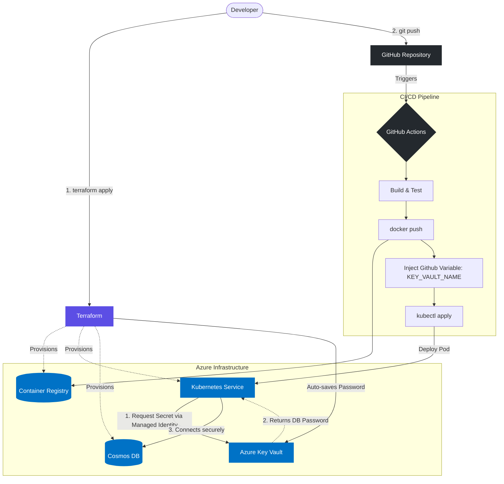

# Renting Microservice

A vehicle fleet management microservice built with **.NET 9** and **MongoDB**, following **Hexagonal Architecture** (Ports & Adapters) and **Domain-Driven Design** principles.

## Tech Stack

- **.NET 9** (ASP.NET Core Web API)
- **MongoDB** (NoSQL persistence)
- **MediatR** (CQRS — Command/Query separation via Mediator pattern)
- **xUnit** + **Moq** (Unit, Infrastructure & Functional tests)
- **Docker Compose** (Local MongoDB)
- **Swagger / OpenAPI** (API documentation)

## Architecture

This project implements a clean **Hexagonal Architecture** where the domain layer has zero dependencies on infrastructure or frameworks:

```
src/
├── Renting.Microservice.Domain/            # Entities, Value Objects, Ports, Exceptions
├── Renting.Microservice.ApplicationCore/   # Use Cases (Input/Output ports)
├── Renting.Microservice.Api/              # Controllers, MediatR Handlers, Presenters
├── Renting.Microservice.Infrastructure/   # MongoDB Repositories, Logging Adapters
├── Renting.Microservice.Host/            # Composition Root (DI, Program.cs)
└── microservice.sln

test/
├── unit/           # 13 unit tests (domain logic + use cases with Moq)
├── functional/     # 1 functional test (full MediatR pipeline + real MongoDB)
├── infrastructure/ # 1 infrastructure test (HTTP pipeline via TestServer)
└── load/           # JMeter (placeholder)
```

### Key Design Decisions

- **Ports & Adapters**: Domain defines interfaces (`IVehicleRepository`, `IRentalRepository`). Infrastructure implements them with MongoDB.
- **CQRS with MediatR**: Each use case is a dedicated `IRequestHandler`, keeping controllers thin.
- **Value Objects**: `ManufactureDate`, `Brand`, `LicensePlate`, `RenterId`, `VehicleId` — all enforce domain invariants at construction time.
- **Aggregate Root**: `Vehicle` owns its rental lifecycle and protects business rules internally.
- **Safe Configuration Defaults**: `appsettings.json` uses valid fallback formats (e.g., `your-keyvault-name` or `https://localhost`) instead of text placeholders to prevent `UriFormatException` crashes during startup if environment variables are missing.

## Getting Started

### Prerequisites

- [.NET SDK 9.0](https://dotnet.microsoft.com/download/dotnet/9.0)
- [Docker](https://www.docker.com/products/docker-desktop/)

### Run Locally

```bash
# 1. Start MongoDB
docker-compose up -d

# 2. Run the API
dotnet run --project src/Renting.Microservice.Host

# 3. Open Swagger
# https://localhost:5001/swagger
```

### Run Tests

```bash
# All tests (15 total)
dotnet test src/microservice.sln

# Unit tests only (13)
dotnet test test/unit/Renting.Microservice.UnitTests

# Functional tests (1) — requires MongoDB on localhost:27017
dotnet test test/functional/Renting.Microservice.FunctionalTests

# Infrastructure tests (1) — no MongoDB required
dotnet test test/infrastructure/Renting.Microservice.InfrastructureTests
```

## Use Cases

| # | Use Case | Endpoint | Description |
|---|----------|----------|-------------|
| 1 | **Create Vehicle** | `POST /api/vehicles` | Registers a new vehicle in the fleet. Validates that the manufacture date is not older than 5 years. |
| 2 | **List Available** | `GET /api/vehicles/available` | Lists all vehicles currently available for rent. |
| 3 | **Rent Vehicle** | `POST /api/vehicles/{id}/rent` | Rents a vehicle to a renter. Validates that the renter does not already have an active rental. |
| 4 | **Return Vehicle** | `POST /api/vehicles/{id}/return` | Returns a rented vehicle, marking it as available again. |

## Business Rules

1. **Maximum vehicle age**: Vehicles with a manufacture date older than 5 years are rejected — enforced in the `ManufactureDate` Value Object.
2. **One active rental per renter**: A renter cannot have more than one vehicle rented simultaneously — enforced in `RentVehicleUseCase` via `IRentalRepository.HasActiveRental()`.

## Patterns Implemented

- Hexagonal Architecture (Ports & Adapters)
- Domain-Driven Design (Entities, Value Objects, Aggregate Roots, Repositories)
- CQRS (Command/Query Responsibility Segregation via MediatR)
- Mediator Pattern (MediatR)
- Presenter Pattern (Output Port → HTTP Response mapping)
- Repository Pattern (MongoDB adapters)
- Dependency Injection (Composition Root in Host)

## Infrastructure as Code (IaC) & Secure Secrets

This repository includes a Terraform configuration (`deploy/terraform/`) to provision a production-like environment implementing **Zero-Touch Secrets Management**:

1. **Azure Resource Group**
2. **Azure Container Registry (ACR)** - Hosts Docker images.
3. **Azure Kubernetes Service (AKS)** - Orchestrates the microservice. Configured with **OIDC Issuer** and **Workload Identity** enabled for modern, secure authentication.
4. **Azure Cosmos DB (MongoDB API)** - Serverless NoSQL database. Explicitly configured with `mongo_server_version = "4.2"` (Wire Version 7) to meet modern .NET MongoDB driver requirements.
5. **Azure Key Vault** - Securely stores Cosmos DB credentials. Terraform configures the Access Policies to grant the AKS Managed Identity read-only (`Get`, `List`) access automatically.

### Deploying Infrastructure

```bash
cd deploy/terraform
terraform init
terraform apply
```
*Note: Terraform will output key_vault_name. Add this value as a **Repository Variable** named KEY_VAULT_NAME in your GitHub repository settings.*

## CI/CD Pipeline & GitOps Flow

Continuous Integration and Deployment are handled by GitHub Actions (`.github/workflows/ci-cd.yml`).

### The Secure Deployment Flow (No secrets in GitHub)

1. **Build & Test**: Restores dependencies, builds the solution, and runs the test suite.
2. **Docker Build & Push**: Builds the image tagged with the Git SHA and pushes it to ACR.
3. **Deploy to AKS**:
   - Replaces the `__KEY_VAULT_NAME__` placeholder in `deployment.yaml` with the public GitHub Repository Variable.
   - Applies the manifests using `kubectl`, including a `LoadBalancer` Service that exposes the API externally on port 80.
   - The Pod starts, authenticates against Azure Key Vault using its Managed Identity, and retrieves the Cosmos DB password directly into memory.

## End-to-End Architecture & Secrets Flow

The following diagram illustrates the complete DevOps lifecycle, highlighting how secrets are isolated from the code repository:



